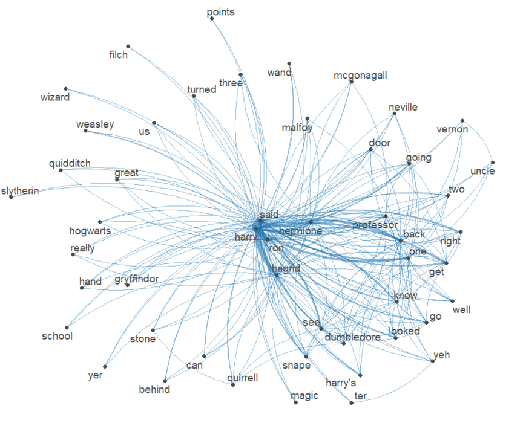

```{r, include=FALSE}
knitr::opts_chunk$set(
  results='asis', 
  echo = FALSE
)
library(tidyverse)
library(glue)

# Set this to true to have links turned into footnotes at the end of the document
PDF_EXPORT <- FALSE

# Holds all the links that were inserted for placement at the end
links <- c()

source('parsing_functions.R')


# First let's get the data, filtering to only the items tagged as
# Resume items
position_data <- read_csv('positions.csv') %>% 
  filter(in_resume) %>% 
  mutate(
    # Build some custom sections by collapsing others
    section = case_when(
      section %in% c('research_positions', 'industry_positions') ~ 'positions', 
      section %in% c('data_science_writings', 'by_me_press') ~ 'writings',
      TRUE ~ section
    )
  ) 

```


Aside
================================================================================


{width=100%}

Contact {#contact}
--------------------------------------------------------------------------------


- <i class="fa fa-envelope"></i> dlyork1@asu.edu
- <i class="fa fa-github"></i> github.com/dlyork
- <i class="fa fa-linkedin"></i> linkedin.com/in/diana-y-53a5061b9/


Language Skills {#skills}
--------------------------------------------------------------------------------


```{r}
skills <- tribble(
  ~skill,               ~level,
  "R",                  3,
  "SQL",                3,
  "Python",             1.5,
  "Apex",               1.5
)
build_skill_bars(skills)
```


Open Source Contributions {#open-source}
--------------------------------------------------------------------------------


- `montyhall`: R package that simulates the Monty Hall problem.


Disclaimer {#disclaimer}
--------------------------------------------------------------------------------

Made w/ [**pagedown**](https://github.com/rstudio/pagedown). 

Source code: [github.com/nstrayer/cv](https://github.com/nstrayer/cv).

Last updated on `r Sys.Date()`.


Main
================================================================================

Diana York {#title}
--------------------------------------------------------------------------------

```{r}
intro_text <- "I have made many customizations to non-profit Salesforce orgs, created dashboards and reports for University officers, and organized app integration in Salesforce.

Currently looking for a data analyst position that allows me to create visualizations and develop data science skills."

# "I have made [visualizations viewed by hundreds of thousands of people](https://www.nytimes.com/interactive/2016/08/26/us/college-student-migration.html), [sped up query times for 25 terabytes of data by an average of 4,800 times](https://livefreeordichotomize.com/2019/06/04/using_awk_and_r_to_parse_25tb/), and built [packages for R](https://github.com/nstrayer/shinysense) that let you [do magic](http://nickstrayer.me/dataDayTexas/).
# 
# Currently searching for a data science position that allows me to build tools using visualization and machine learning to help people explore and understand their data. 
# "


cat(sanitize_links(intro_text))
```


Education {data-icon=graduation-cap data-concise=true}
--------------------------------------------------------------------------------

```{r}
position_data %>% print_section('education')
```


Selected Positions {data-icon=suitcase}
--------------------------------------------------------------------------------

```{r}
position_data %>% print_section('positions')
```

Certificates and Achievements {data-icon=award}
--------------------------------------------------------------------------------


```{r}
position_data %>% print_section('certificates')
```

Volunteer and Community Service {data-icon=hand-holding}
--------------------------------------------------------------------------------


```{r}
position_data %>% print_section('volunteer')
```

Projects {data-icon=project-diagram}
--------------------------------------------------------------------------------


```{r}
position_data %>% print_section('projects')
```
